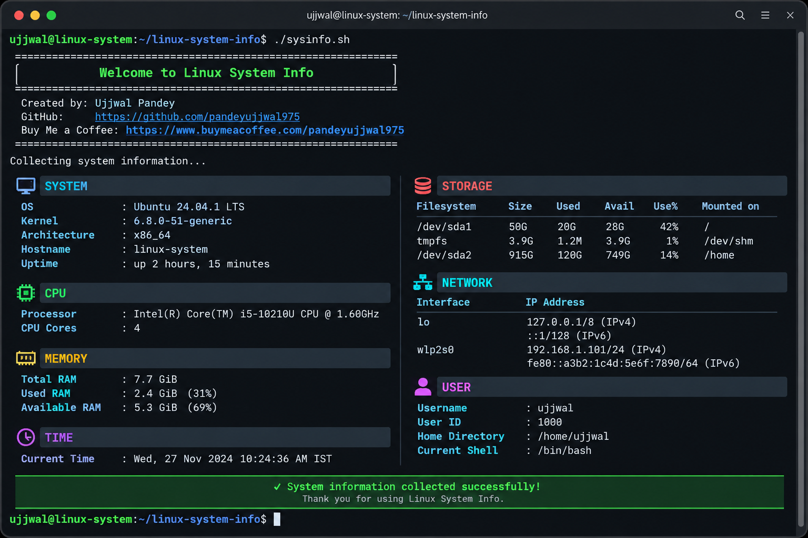

# Linux System Info

<p align="center">
  
</p>

<h1 align="center">Linux System Info</h1>

<p align="center">
  <strong>A lightweight Bash utility that turns scattered Linux system commands into one clean, readable terminal report.</strong>
</p>

<p align="center">
  <a href="https://github.com/pandeyujjwal975/linux-system-info">
    
  </a>
  <a href="https://github.com/pandeyujjwal975/linux-system-info/stargazers">
    
  </a>
  <a href="https://github.com/pandeyujjwal975/linux-system-info/network/members">
    
  </a>
  <a href="https://github.com/pandeyujjwal975/linux-system-info/issues">
    
  </a>
</p>

<p align="center">
  
  
  
  
  
</p>

<p align="center">
  <a href="#about">About</a> •
  <a href="#features">Features</a> •
  <a href="#preview">Preview</a> •
  <a href="#installation">Installation</a> •
  <a href="#usage">Usage</a> •
  <a href="#testing">Testing</a> •
  <a href="#contributing">Contributing</a>
</p>

---

## Contents

<table>
<tr>
<td>

**Project**

- [About](#about)
- [Features](#features)
- [Preview](#preview)
- [Tech Stack](#tech-stack)
- [Requirements](#requirements)

</td>

<td>

**Getting Started**

- [Installation](#installation)
- [Quick Start](#quick-start)
- [Usage](#usage)
- [How It Works](#how-it-works)

</td>

<td>

**Development**

- [Project Structure](#project-structure)
- [Testing](#testing)
- [Development](#development)
- [Contributing](#contributing)

</td>

<td>

**More**

- [Roadmap](#roadmap)
- [Troubleshooting](#troubleshooting)
- [Security](#security)
- [Support](#support-the-project)
- [License](#license)
- [Author](#author)

</td>
</tr>
</table>

---

# About

**Linux System Info** is a lightweight Bash utility for quickly viewing useful information about a Linux system directly from the terminal.

Linux provides powerful commands for inspecting a machine, but the information is often scattered across different commands and system files.

For example:

```text
uname
hostname
uptime
nproc
free
df
ip
whoami
id
date

Linux System Info brings these pieces together into one readable terminal report.

The goal is simple:

Multiple Linux Commands
          ↓
   One Bash Utility
          ↓
 One Readable Report

The project is intentionally built without a large framework or external application.

It uses Bash and commonly available Linux command-line utilities.


---

Why Linux System Info?

System information is useful when:

Checking a Linux machine quickly

Learning Bash scripting

Learning Linux commands

Troubleshooting a system

Checking CPU and RAM

Checking storage usage

Checking network interfaces

Identifying the current user

Practicing command-line automation

Building Linux administration skills


Instead of manually running several commands, run:

./sysinfo.sh

and get a structured overview.


---

Features

<table>
<thead>
<tr>
<th align="center">Module</th>
<th>What It Shows</th>
<th align="center">Status</th>
</tr>
</thead><tbody><tr>
<td align="center">

</td>
<td>
Operating system, kernel version, architecture, hostname and system uptime
</td>
<td align="center">
<strong>READY</strong>
</td>
</tr><tr>
<td align="center">

</td>
<td>
Processor information and CPU core count
</td>
<td align="center">
<strong>READY</strong>
</td>
</tr><tr>
<td align="center">

</td>
<td>
Total RAM, used RAM and available RAM
</td>
<td align="center">
<strong>READY</strong>
</td>
</tr><tr>
<td align="center">

</td>
<td>
Filesystem, total space, used space, available space and usage percentage
</td>
<td align="center">
<strong>READY</strong>
</td>
</tr><tr>
<td align="center">

</td>
<td>
Network interfaces and IP addresses
</td>
<td align="center">
<strong>READY</strong>
</td>
</tr><tr>
<td align="center">

</td>
<td>
Username, UID, home directory and current shell
</td>
<td align="center">
<strong>READY</strong>
</td>
</tr><tr>
<td align="center">

</td>
<td>
Current system date and time
</td>
<td align="center">
<strong>READY</strong>
</td>
</tr></tbody>
</table>
---

Information Collected

System

The utility can display:

Operating System
Kernel Version
Architecture
Hostname
System Uptime

CPU

Processor Model
CPU Core Count

Memory

Total RAM
Used RAM
Available RAM

Storage

Filesystem
Total Space
Used Space
Available Space
Usage Percentage

Network

Network Interfaces
IP Addresses

User

Username
User ID
Home Directory
Current Shell

Time

Current Date
Current Time


---

Preview

<p align="center">
  
</p>The preview image represents the type of terminal report produced by the script.

The actual values will change according to the Linux system on which the script is executed.


---

Terminal Output

Example output:

==============================================================
                 Welcome to Linux System Info
==============================================================

Created by: Ujjwal Pandey

GitHub:
https://github.com/pandeyujjwal975

Buy Me a Coffee:
https://www.buymeacoffee.com/pandeyujjwal975

==============================================================

Collecting system information...

SYSTEM
--------------------------------------------------------------
OS            : Ubuntu
Kernel        : 6.x.x
Architecture  : x86_64
Hostname      : linux-machine
Uptime        : up 2 hours

CPU
--------------------------------------------------------------
Processor     : Intel(R) Core(TM) i5
CPU Cores     : 4

MEMORY
--------------------------------------------------------------
Total RAM     : 7.7 GiB
Used RAM      : 2.4 GiB
Available RAM : 5.3 GiB

STORAGE
--------------------------------------------------------------
Filesystem    : /dev/sda1
Total Space   : 100G
Used Space    : 35G
Available     : 65G
Usage         : 35%

NETWORK
--------------------------------------------------------------
Interface     : wlan0
IP Address    : 192.168.1.100/24

USER
--------------------------------------------------------------
Username      : user
User ID       : 1000
Home          : /home/user
Shell         : /bin/bash

TIME
--------------------------------------------------------------
Date          : 2026-09-08
Time          : 05:37:00

==============================================================
                    Scan Complete
==============================================================

> The values above are examples only. Your system will display its own information.


---

Tech Stack

<table>
<thead>
<tr>
<th align="center">Technology</th>
<th>Purpose</th>
</tr>
</thead><tbody><tr>
<td align="center">

</td>
<td>
Main scripting language used to build the utility.
</td>
</tr><tr>
<td align="center">

</td>
<td>
Operating environment and source of system information.
</td>
</tr><tr>
<td align="center">

</td>
<td>
Version control and project development.
</td>
</tr><tr>
<td align="center">

</td>
<td>
Repository hosting, collaboration and open-source contribution.
</td>
</tr></tbody>
</table>
---

Design Philosophy

Linux System Info follows a simple engineering philosophy:

SIMPLE
                |
                v
           READABLE CODE
                |
                v
            NO BLOAT
                |
                v
          LOCAL EXECUTION
                |
                v
          FAST OUTPUT
                |
                v
       BEGINNER FRIENDLY
                |
                v
         EASY TO EXTEND

The project intentionally avoids unnecessary dependencies.


---

Requirements

<table>
<thead>
<tr>
<th>Requirement</th>
<th>Details</th>
</tr>
</thead><tbody><tr>
<td>Operating System</td>
<td>Linux</td>
</tr><tr>
<td>Shell</td>
<td>Bash 4.x or newer</td>
</tr><tr>
<td>Dependencies</td>
<td>Common Linux command-line utilities</td>
</tr><tr>
<td>Internet</td>
<td>Not required to run the script</td>
</tr><tr>
<td>Root Access</td>
<td>Not normally required</td>
</tr></tbody>
</table>
---

Supported Linux Distributions

The script is intended for common Linux environments such as:

Ubuntu
Debian
Linux Mint
Fedora
Arch Linux
Kali Linux
Rocky Linux
AlmaLinux

Other Bash-compatible Linux distributions may also work.


---

Installation

Clone the Repository

git clone https://github.com/pandeyujjwal975/linux-system-info.git

Enter the Project Directory

cd linux-system-info

Make the Script Executable

chmod +x sysinfo.sh

Run the Script

./sysinfo.sh


---

Quick Start

For a fresh installation:

git clone https://github.com/pandeyujjwal975/linux-system-info.git
cd linux-system-info
chmod +x sysinfo.sh
./sysinfo.sh

That's it.

No database.

No API key.

No configuration file.

No external framework.


---

Usage

Normal Execution

./sysinfo.sh

Run Through Bash

If the executable permission has not been added:

bash sysinfo.sh

Check Script Syntax

Before executing the script, you can validate the Bash syntax:

bash -n sysinfo.sh

If no error is displayed, the syntax check passed.

Run Tests

bash tests/test.sh


---

Command Reference

<table>
<thead>
<tr>
<th>Command</th>
<th>Purpose</th>
</tr>
</thead><tbody><tr>
<td><code>./sysinfo.sh</code></td>
<td>Run the Linux System Info utility</td>
</tr><tr>
<td><code>bash sysinfo.sh</code></td>
<td>Execute the script through Bash</td>
</tr><tr>
<td><code>bash -n sysinfo.sh</code></td>
<td>Check Bash syntax</td>
</tr><tr>
<td><code>bash tests/test.sh</code></td>
<td>Run the project test suite</td>
</tr><tr>
<td><code>chmod +x sysinfo.sh</code></td>
<td>Add executable permission</td>
</tr></tbody>
</table>
---

How It Works

The script collects information from standard Linux commands and system files.

The basic flow is:

START
  |
  v
Welcome Screen
  |
  v
Collect System Information
  |
  +------> Operating System
  |
  +------> Kernel
  |
  +------> Architecture
  |
  +------> Hostname
  |
  +------> Uptime
  |
  +------> CPU
  |
  +------> Memory
  |
  +------> Storage
  |
  +------> Network
  |
  +------> User
  |
  +------> Time
  |
  v
Format Information
  |
  v
Display Terminal Report
  |
  v
END


---

Linux Commands Used

The project can use common Linux utilities such as:

<table>
<thead>
<tr>
<th>Command</th>
<th>Purpose</th>
</tr>
</thead><tbody><tr>
<td><code>uname</code></td>
<td>Kernel and system architecture information</td>
</tr><tr>
<td><code>hostname</code></td>
<td>System hostname</td>
</tr><tr>
<td><code>uptime</code></td>
<td>System uptime</td>
</tr><tr>
<td><code>nproc</code></td>
<td>CPU core count</td>
</tr><tr>
<td><code>free</code></td>
<td>Memory information</td>
</tr><tr>
<td><code>df</code></td>
<td>Filesystem and storage information</td>
</tr><tr>
<td><code>ip</code></td>
<td>Network interfaces and IP addresses</td>
</tr><tr>
<td><code>whoami</code></td>
<td>Current username</td>
</tr><tr>
<td><code>id</code></td>
<td>User identity information</td>
</tr><tr>
<td><code>date</code></td>
<td>Current date and time</td>
</tr></tbody>
</table>
---

Linux System Files

The project can also read standard Linux system information sources.

<table>
<thead>
<tr>
<th>Path</th>
<th>Information</th>
</tr>
</thead><tbody><tr>
<td><code>/etc/os-release</code></td>
<td>Linux distribution information</td>
</tr><tr>
<td><code>/proc/cpuinfo</code></td>
<td>Processor information</td>
</tr></tbody>
</table>
---

Project Structure

linux-system-info/
│
├── sysinfo.sh
│
├── tests/
│   └── test.sh
│
├── docs/
│   ├── usage.md
│   │
│   └── screenshots/
│       ├── terminal-output.png
│       └── thumbnail.png
│
├── README.md
├── LICENSE
├── CONTRIBUTING.md
├── CHANGELOG.md
└── .gitignore


---

File Structure Explained

<table>
<thead>
<tr>
<th>Path</th>
<th>Purpose</th>
</tr>
</thead><tbody><tr>
<td><code>sysinfo.sh</code></td>
<td>Main Linux system information Bash script.</td>
</tr><tr>
<td><code>tests/test.sh</code></td>
<td>Basic automated test script for validating the project.</td>
</tr><tr>
<td><code>docs/usage.md</code></td>
<td>Detailed usage and command documentation.</td>
</tr><tr>
<td><code>docs/screenshots/terminal-output.png</code></td>
<td>Terminal output preview image.</td>
</tr><tr>
<td><code>docs/screenshots/thumbnail.png</code></td>
<td>Project thumbnail / GitHub preview image.</td>
</tr><tr>
<td><code>README.md</code></td>
<td>Main project documentation.</td>
</tr><tr>
<td><code>LICENSE</code></td>
<td>MIT open-source license.</td>
</tr><tr>
<td><code>CONTRIBUTING.md</code></td>
<td>Guidelines for contributors.</td>
</tr><tr>
<td><code>CHANGELOG.md</code></td>
<td>Project version history and changes.</td>
</tr><tr>
<td><code>.gitignore</code></td>
<td>Files and directories ignored by Git.</td>
</tr></tbody>
</table>
---

Testing

The project includes a basic test script:

bash tests/test.sh

The test script is intended to verify the basic integrity of the project.


---

Syntax Test

Run:

bash -n sysinfo.sh

A successful syntax check normally produces no output.


---

Manual Test

Run:

./sysinfo.sh

Verify that the terminal displays the expected sections.


---

Test Coverage

The basic test suite can verify items such as:

Main script exists
Main script is executable
Bash syntax is valid
Welcome message exists
Creator information exists
System section exists
CPU section exists
Memory section exists
Storage section exists
Network section exists
User section exists
Time section exists


---

Development

Clone the repository:

git clone https://github.com/pandeyujjwal975/linux-system-info.git
cd linux-system-info

Create a feature branch:

git checkout -b feature/my-feature

Make your changes.

Check syntax:

bash -n sysinfo.sh

Run tests:

bash tests/test.sh

Run the application:

./sysinfo.sh

Review changes:

git diff


---

Recommended Development Workflow

ISSUE
         |
         v
       FORK
         |
         v
       CLONE
         |
         v
      NEW BRANCH
         |
         v
        CODE
         |
         v
       TEST
         |
         v
     REVIEW DIFF
         |
         v
       COMMIT
         |
         v
        PUSH
         |
         v
   PULL REQUEST
         |
         v
       REVIEW
         |
         v
       MERGE


---

Contributing

Contributions are welcome.

If you want to improve Linux System Info, you can contribute through:

Bug fixes

New system information modules

Improved Bash code

Better error handling

Documentation improvements

Test improvements

Linux distribution compatibility

Performance improvements

New output formats


Before contributing, read:

CONTRIBUTING.md


---

Contribution Ideas

<table>
<thead>
<tr>
<th>Area</th>
<th>Possible Contribution</th>
</tr>
</thead><tbody><tr>
<td>Hardware</td>
<td>GPU information, USB devices and hardware details</td>
</tr><tr>
<td>Battery</td>
<td>Battery percentage and charging status</td>
</tr><tr>
<td>Temperature</td>
<td>CPU and system temperature information</td>
</tr><tr>
<td>Storage</td>
<td>Disk health and mounted device information</td>
</tr><tr>
<td>Network</td>
<td>More detailed interface and connection information</td>
</tr><tr>
<td>CLI</td>
<td><code>--help</code>, <code>--version</code> and command-line options</td>
</tr><tr>
<td>Output</td>
<td>JSON and machine-readable output</td>
</tr><tr>
<td>Testing</td>
<td>Expanded automated test coverage</td>
</tr><tr>
<td>Compatibility</td>
<td>Improved support across Linux distributions</td>
</tr><tr>
<td>Documentation</td>
<td>Examples, tutorials and troubleshooting guides</td>
</tr></tbody>
</table>
---

Roadmap

Version 1.0

<table>
<thead>
<tr>
<th>Feature</th>
<th align="center">Status</th>
</tr>
</thead><tbody><tr>
<td>Operating system detection</td>
<td align="center">DONE</td>
</tr><tr>
<td>Kernel information</td>
<td align="center">DONE</td>
</tr><tr>
<td>Architecture detection</td>
<td align="center">DONE</td>
</tr><tr>
<td>Hostname information</td>
<td align="center">DONE</td>
</tr><tr>
<td>System uptime</td>
<td align="center">DONE</td>
</tr><tr>
<td>CPU information</td>
<td align="center">DONE</td>
</tr><tr>
<td>Memory information</td>
<td align="center">DONE</td>
</tr><tr>
<td>Storage information</td>
<td align="center">DONE</td>
</tr><tr>
<td>Network information</td>
<td align="center">DONE</td>
</tr><tr>
<td>User information</td>
<td align="center">DONE</td>
</tr><tr>
<td>Time information</td>
<td align="center">DONE</td>
</tr><tr>
<td>Welcome screen</td>
<td align="center">DONE</td>
</tr><tr>
<td>Basic tests</td>
<td align="center">DONE</td>
</tr><tr>
<td>Documentation</td>
<td align="center">DONE</td>
</tr></tbody>
</table>
---

Future Releases

<table>
<thead>
<tr>
<th>Feature</th>
<th align="center">Status</th>
</tr>
</thead><tbody><tr>
<td><code>--help</code> option</td>
<td align="center">PLANNED</td>
</tr><tr>
<td><code>--version</code> option</td>
<td align="center">PLANNED</td>
</tr><tr>
<td>JSON output</td>
<td align="center">PLANNED</td>
</tr><tr>
<td>GPU detection</td>
<td align="center">PLANNED</td>
</tr><tr>
<td>Battery information</td>
<td align="center">PLANNED</td>
</tr><tr>
<td>Temperature information</td>
<td align="center">PLANNED</td>
</tr><tr>
<td>Disk health information</td>
<td align="center">PLANNED</td>
</tr><tr>
<td>Extended network information</td>
<td align="center">PLANNED</td>
</tr><tr>
<td>Additional automated tests</td>
<td align="center">PLANNED</td>
</tr></tbody>
</table>
---

Troubleshooting

Permission Denied

If you see:

Permission denied

run:

chmod +x sysinfo.sh

Then:

./sysinfo.sh

Alternatively:

bash sysinfo.sh


---

Script Not Found

Check the current directory:

pwd

List files:

ls -la

Make sure you are inside the project directory:

linux-system-info/


---

Bash Not Available

Check Bash:

command -v bash

Check the version:

bash --version


---

Network Information Missing

The network section may use the Linux ip command.

Check whether it exists:

command -v ip

You can also test it directly:

ip -brief address


---

Syntax Error

Check the script:

bash -n sysinfo.sh

If Bash reports an error, inspect the reported line.

You can also display the script with line numbers:

nl -ba sysinfo.sh


---

Security

Linux System Info is designed as a local system-information utility.

Normal execution does not require:

sudo
Root access
API keys
Database
Cloud account
Remote server

The script should be reviewed before execution if it has been modified or obtained from an untrusted source.

You can inspect the source code before running it:

less sysinfo.sh

or:

cat sysinfo.sh


---

Privacy

Linux System Info is intended for local execution.

The utility collects information from the Linux environment where it is executed and displays the information in the terminal.

The project does not intentionally upload collected system information to a remote service.


---

Documentation

Detailed usage information is available in:

docs/usage.md

Contribution guidelines:

CONTRIBUTING.md

Project history:

CHANGELOG.md

License:

LICENSE


---

Version

Linux System Info
Version: 1.0.0

Changes are documented in:

CHANGELOG.md


---

License

This project is licensed under the MIT License.

The MIT License allows people to use, modify, distribute and contribute to the project subject to the license terms.

See:

LICENSE

for the complete license text.


---

Support the Project

If Linux System Info helped you learn Linux, Bash or system administration, you can support the project.

<p align="center">
  <a href="https://www.buymeacoffee.com/pandeyujjwal975">
    
  </a>
</p><p align="center">
  <strong>Every contribution helps keep the project moving forward.</strong>
</p>
---

Author

<p align="center">
  <strong>Ujjwal Pandey</strong>
</p><p align="center">
  <a href="https://github.com/pandeyujjwal975">
    
  </a>  <a href="https://www.buymeacoffee.com/pandeyujjwal975">
    
  </a>
</p>
---

Repository

<p align="center">
  <a href="https://github.com/pandeyujjwal975/linux-system-info">
    
  </a>
</p><p align="center">
  <a href="https://github.com/pandeyujjwal975/linux-system-info/issues">
    Report an Issue
  </a>
  •
  <a href="https://github.com/pandeyujjwal975/linux-system-info/pulls">
    Submit a Pull Request
  </a>
  •
  <a href="https://github.com/pandeyujjwal975/linux-system-info/stargazers">
    Star the Project
  </a>
</p>
---

Open Source

Linux System Info is a small practical project built around the Linux command line.

The project focuses on:

LINUX
   +
BASH
   +
TERMINAL
   +
SYSTEM INFORMATION
   +
AUTOMATION
   +
OPEN SOURCE

The codebase is intentionally kept simple so that beginners can read the source, understand the commands and contribute improvements.


---

Learning Goals

This project can be used as a practical exercise for learning:

<table>
<thead>
<tr>
<th>Topic</th>
<th>What You Can Learn</th>
</tr>
</thead><tbody><tr>
<td>Bash</td>
<td>Variables, commands, functions, conditions and shell scripting</td>
</tr><tr>
<td>Linux</td>
<td>System information and command-line utilities</td>
</tr><tr>
<td>Git</td>
<td>Branches, commits, diffs and version control</td>
</tr><tr>
<td>GitHub</td>
<td>Repositories, issues, pull requests and collaboration</td>
</tr><tr>
<td>Testing</td>
<td>Basic shell-based validation</td>
</tr><tr>
<td>Documentation</td>
<td>Writing useful open-source project documentation</td>
</tr></tbody>
</table>
---

Project Goals

The long-term goal is to keep Linux System Info:

FAST
READABLE
LIGHTWEIGHT
DEPENDENCY-LIGHT
BEGINNER-FRIENDLY
OPEN SOURCE
EASY TO EXTEND

Future versions can expand the utility while keeping the core philosophy intact.


---

Acknowledgements

This project was created as a practical Linux and Bash utility.

It is intended to help users understand how common Linux commands can be combined into a useful automation script.

Thanks to the Linux and open-source communities for the tools, documentation and ecosystem that make projects like this possible.


---

<p align="center">
  
  
  
  
</p><p align="center">
  <strong>Linux • Bash • Terminal • System Information</strong>
</p><p align="center">
  Built with Bash for the Linux community.
</p><p align="center">
  <sub>Created by Ujjwal Pandey</sub>
</p>
```Important folder check

README में जिन images को reference किया गया है, GitHub repository में ये exact paths होने चाहिए:

linux-system-info/
│
├── docs/
│   └── screenshots/
│       ├── thumbnail.png
│       └── terminal-output.png
│
├── tests/
│   └── test.sh
│
├── sysinfo.sh
├── README.md
├── LICENSE
├── CONTRIBUTING.md
├── CHANGELOG.md
└── .gitignore
