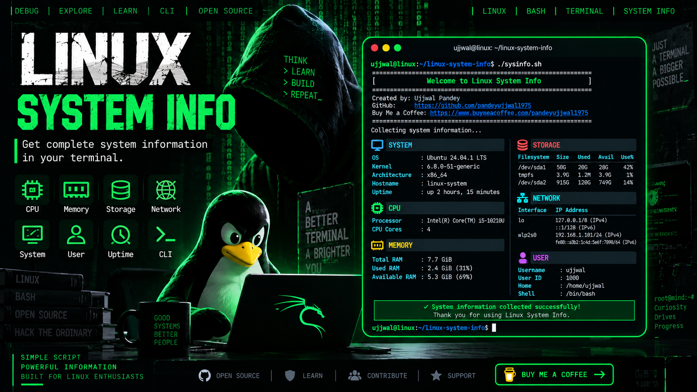

# Linux System Info

<p align="center">
  
</p>

<p align="center"><strong>A lightweight Bash utility that turns scattered Linux system commands into one clean terminal report.</strong></p>

<p align="center">
  <a href="https://github.com/pandeyujjwal975/linux-system-info"></a>
  
  
  
</p>

<p align="center">
  <a href="#about">About</a> • <a href="#features">Features</a> • <a href="#preview">Preview</a> • <a href="#installation">Installation</a> • <a href="#usage">Usage</a> • <a href="#testing">Testing</a> • <a href="#contributing">Contributing</a>
</p>

---

## Table of Contents

- [About](#about)
- [Why Linux System Info](#why-linux-system-info)
- [Features](#features)
- [Preview](#preview)
- [Tech Stack](#tech-stack)
- [Requirements](#requirements)
- [Supported Linux Distributions](#supported-linux-distributions)
- [Installation](#installation)
- [Usage](#usage)
- [How It Works](#how-it-works)
- [Commands Used](#linux-commands-used)
- [Project Structure](#project-structure)
- [Testing](#testing)
- [Development](#development)
- [Contributing](#contributing)
- [Roadmap](#roadmap)
- [Troubleshooting](#troubleshooting)
- [Security & Privacy](#security--privacy)
- [License](#license)
- [Support](#support-the-project)
- [Author](#author)

---

# About

**Linux System Info** is a lightweight Bash utility for quickly viewing useful information about a Linux system directly from the terminal.

Linux provides powerful commands for inspecting a machine, but useful information is often scattered across different commands and system files. This project brings those checks together into **one readable terminal report**.

It is intentionally simple, dependency-light, beginner-friendly and easy to extend.

---

# Why Linux System Info?

Instead of manually running:

```bash
uname -a
hostname
uptime
nproc
free -h
df -h
ip address
whoami
id
date
```

you can simply run:

```bash
./sysinfo.sh
```

### Built for

- Linux beginners
- Bash learners
- Students
- Developers
- System administrators
- Troubleshooting
- Open-source contributors
- Linux command-line practice
- Quick system checks

---

# Features

| Module | What It Shows | Status |
|---|---|:---:|
| SYSTEM | OS, kernel, architecture, hostname, uptime | READY |
| CPU | Processor model and core count | READY |
| MEMORY | Total, used and available RAM | READY |
| STORAGE | Filesystem, total, used, free and usage | READY |
| NETWORK | Interfaces and IP addresses | READY |
| USER | Username, UID, home directory and shell | READY |
| TIME | Current date and time | READY |

---

# Preview

<p align="center">
  
</p>

Actual values depend on the Linux system where the script is executed.

## Example Output

```text
==============================================================
                 Welcome to Linux System Info
==============================================================

Created by: Ujjwal Pandey

GitHub:
https://github.com/pandeyujjwal975

Buy Me a Coffee:
https://www.buymeacoffee.com/pandeyujjwal975

==============================================================

Collecting system information...

SYSTEM
--------------------------------------------------------------
OS            : Ubuntu
Kernel        : 6.x.x
Architecture  : x86_64
Hostname      : linux-machine
Uptime        : up 2 hours

CPU
--------------------------------------------------------------
Processor     : Intel(R) Core(TM) i5
CPU Cores     : 4

MEMORY
--------------------------------------------------------------
Total RAM     : 7.7 GiB
Used RAM      : 2.4 GiB
Available RAM : 5.3 GiB

STORAGE
--------------------------------------------------------------
Filesystem    : /dev/sda1
Total Space   : 100G
Used Space    : 35G
Available     : 65G
Usage         : 35%

NETWORK
--------------------------------------------------------------
Interface     : wlan0
IP Address    : 192.168.1.100/24

USER
--------------------------------------------------------------
Username      : user
User ID       : 1000
Home          : /home/user
Shell         : /bin/bash

TIME
--------------------------------------------------------------
Date          : 2026-09-08
Time          : 05:37:00

==============================================================
                    Scan Complete
==============================================================
```

> The values above are illustrative.

---

# Tech Stack

| Technology | Purpose |
|---|---|
| Bash | Main scripting language |
| Linux | Operating environment and system information source |
| Git | Version control |
| GitHub | Repository hosting and collaboration |

<p align="center">
  
  
  
  
</p>

---

# Requirements

- Linux-based operating system
- Bash 4.x or newer
- Standard Linux command-line utilities
- Git for cloning the repository

No database, API key, cloud account, external framework or root access is required for normal use.

---

# Supported Linux Distributions

The project is intended for common Linux distributions including:

- Ubuntu
- Debian
- Linux Mint
- Fedora
- Arch Linux
- Kali Linux
- Rocky Linux
- AlmaLinux

Other Bash-compatible Linux distributions may also work.

---

# Installation

```bash
git clone https://github.com/pandeyujjwal975/linux-system-info.git
cd linux-system-info
chmod +x sysinfo.sh
./sysinfo.sh
```

### Run without changing permissions

```bash
bash sysinfo.sh
```

---

# Usage

### Run normally

```bash
./sysinfo.sh
```

### Check Bash syntax

```bash
bash -n sysinfo.sh
```

A successful syntax check normally produces no output.

---

# How It Works

```text
START
  |
  v
Welcome Screen
  |
  v
Collect System Information
  |
  +---- Operating System
  +---- Kernel
  +---- Architecture
  +---- Hostname
  +---- Uptime
  +---- CPU
  +---- Memory
  +---- Storage
  +---- Network
  +---- User
  +---- Time
  |
  v
Format Information
  |
  v
Display Terminal Report
  |
  v
END
```

The script collects information locally using standard Linux commands and system files.

---

# Linux Commands Used

| Command | Purpose |
|---|---|
| `uname` | Kernel and architecture information |
| `hostname` | Hostname |
| `uptime` | System uptime |
| `nproc` | CPU core count |
| `free` | Memory information |
| `df` | Filesystem and storage information |
| `ip` | Network interfaces and IP addresses |
| `whoami` | Current username |
| `id` | User identity information |
| `date` | Current date and time |

## Linux System Files

| Path | Purpose |
|---|---|
| `/etc/os-release` | Linux distribution information |
| `/proc/cpuinfo` | Processor information |

---

# Project Structure

```text
linux-system-info/
│
├── sysinfo.sh
│
├── tests/
│   └── test.sh
│
├── docs/
│   ├── usage.md
│   └── screenshots/
│       ├── thumbnail.png
│       └── terminal-output.png
│
├── README.md
├── LICENSE
├── CONTRIBUTING.md
├── CHANGELOG.md
└── .gitignore
```

| File / Directory | Purpose |
|---|---|
| `sysinfo.sh` | Main system information script |
| `tests/test.sh` | Basic project test suite |
| `docs/usage.md` | Detailed usage guide |
| `docs/screenshots/thumbnail.png` | Repository thumbnail |
| `docs/screenshots/terminal-output.png` | Terminal preview |
| `README.md` | Main documentation |
| `LICENSE` | Open-source license |
| `CONTRIBUTING.md` | Contribution guidelines |
| `CHANGELOG.md` | Project change history |
| `.gitignore` | Git ignored files |

---

# Testing

Run the project test suite:

```bash
bash tests/test.sh
```

Run a syntax check:

```bash
bash -n sysinfo.sh
```

Run the utility manually:

```bash
./sysinfo.sh
```

The tests can verify that the main script exists, is executable, has valid Bash syntax, contains the welcome/creator information and provides the expected SYSTEM, CPU, MEMORY, STORAGE, NETWORK, USER and TIME sections.

---

# Development

```bash
git clone https://github.com/pandeyujjwal975/linux-system-info.git
cd linux-system-info
git checkout -b feature/my-feature
```

After making changes:

```bash
bash -n sysinfo.sh
bash tests/test.sh
./sysinfo.sh
git diff
git status
```

---

# Contributing

Contributions are welcome.

Useful contribution areas include:

- Bug fixes
- New system-information modules
- Bash improvements
- Error handling
- Documentation
- Tests
- Linux distribution compatibility
- Performance improvements
- New output formats
- Code cleanup

Please read [CONTRIBUTING.md](CONTRIBUTING.md) before submitting a pull request.

### Contribution Workflow

```text
ISSUE -> FORK -> CLONE -> BRANCH -> CODE -> TEST -> COMMIT -> PUSH -> PULL REQUEST -> REVIEW -> MERGE
```

---

# Roadmap

## Version 1.0

| Feature | Status |
|---|:---:|
| Operating system detection | DONE |
| Kernel information | DONE |
| Architecture detection | DONE |
| Hostname information | DONE |
| System uptime | DONE |
| CPU information | DONE |
| Memory information | DONE |
| Storage information | DONE |
| Network information | DONE |
| User information | DONE |
| Time information | DONE |
| Welcome screen | DONE |
| Basic tests | DONE |
| Documentation | DONE |

## Future Releases

| Feature | Status |
|---|:---:|
| `--help` option | PLANNED |
| `--version` option | PLANNED |
| JSON output | PLANNED |
| GPU detection | PLANNED |
| Battery information | PLANNED |
| Temperature information | PLANNED |
| Disk health information | PLANNED |
| Extended network information | PLANNED |
| More automated tests | PLANNED |

---

# Troubleshooting

## Permission denied

```bash
chmod +x sysinfo.sh
./sysinfo.sh
```

Or:

```bash
bash sysinfo.sh
```

## Script not found

```bash
pwd
ls -la
```

Make sure `sysinfo.sh` exists in the current directory.

## Check Bash

```bash
command -v bash
bash --version
```

## Network information missing

```bash
command -v ip
ip -brief address
```

## Syntax error

```bash
bash -n sysinfo.sh
nl -ba sysinfo.sh
```

---

# Security & Privacy

Linux System Info is designed as a local system-information utility.

Normal execution does not require sudo, root access, API keys, databases or cloud services.

Always review shell scripts before executing modified or untrusted code:

```bash
less sysinfo.sh
```

The project is intended to display locally collected system information and does not intentionally upload collected information to a remote service.

---

# Documentation

- [Usage Guide](docs/usage.md)
- [Contribution Guidelines](CONTRIBUTING.md)
- [Changelog](CHANGELOG.md)
- [License](LICENSE)

---

# Version

```text
Linux System Info
Version: 1.0.0
```

---

# License

This project is licensed under the **MIT License**.

See [LICENSE](LICENSE) for the complete license text.

---

# Support the Project

If Linux System Info helped you learn Linux, Bash or system administration, you can support the project.

<p align="center">
  <a href="https://www.buymeacoffee.com/pandeyujjwal975">
    
  </a>
</p>

---

# Author

<p align="center"><strong>Ujjwal Pandey</strong></p>

<p align="center">
  <a href="https://github.com/pandeyujjwal975"></a>
  <a href="https://www.buymeacoffee.com/pandeyujjwal975"></a>
</p>

---

<p align="center">
  <strong>Linux • Bash • Terminal • System Information</strong>
</p>

<p align="center">Built with Bash for the Linux community.</p>

<p align="center"><sub>Created by Ujjwal Pandey</sub></p>
